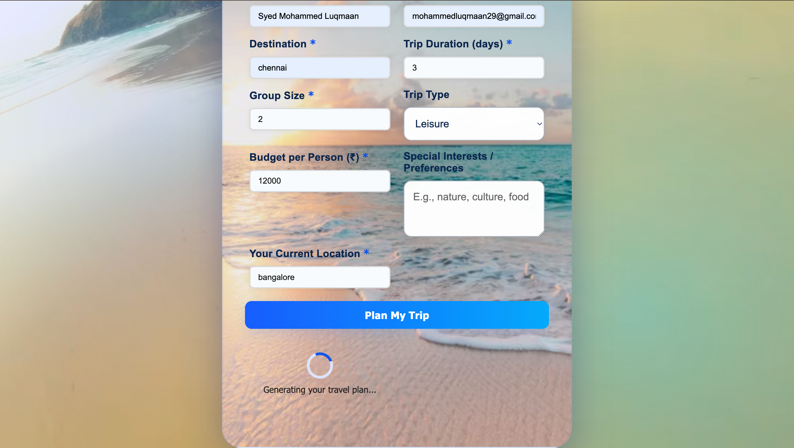
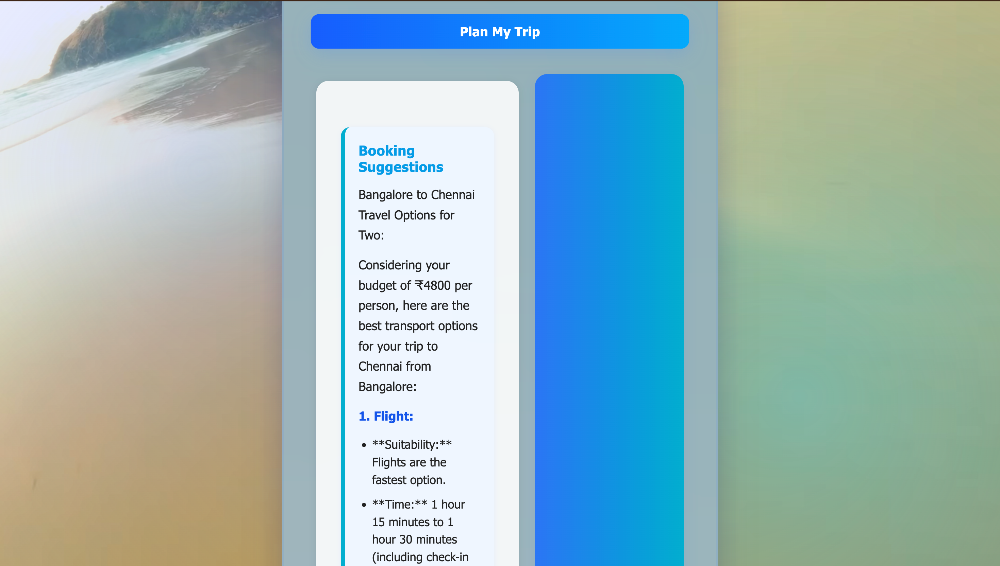
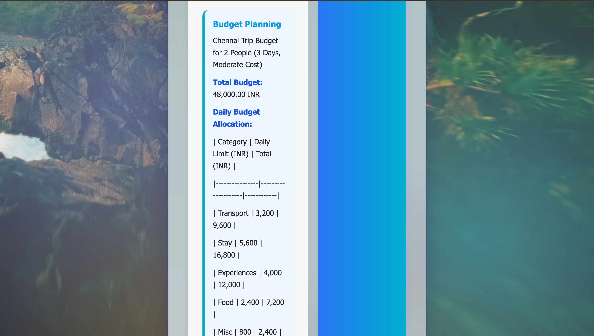

# 🌍 TripTacticx – Multi-Agent Travel Planner

> **A modular, AI-powered travel planning platform leveraging a multi-agent system for rich, personalized itineraries.**

---

## 🧠 Multi-Agent System: Core of TripTacticx

TripTacticx is built around a **multi-agent architecture**. Each agent is a specialized, independent module responsible for a specific aspect of travel planning. This design brings several advantages:

- **Separation of Concerns:** Each agent focuses on a single domain (e.g., booking, food, logistics), making the system modular and easy to extend.
- **Parallelism & Scalability:** Agents can be run in parallel or distributed, allowing for faster and more scalable itinerary generation.
- **Personalization:** Each agent can use its own logic, data sources, or even AI models, enabling highly tailored recommendations for each user.
- **Maintainability:** New features or improvements can be added by updating or swapping out individual agents without affecting the rest of the system.

### 🧩 Agents in TripTacticx

| Agent                | Role/Responsibility                        | Example Output Type                |
|----------------------|--------------------------------------------|------------------------------------|
| Booking Agent        | Finds and suggests travel bookings         | List of flights/trains, prices     |
| Stay Agent           | Recommends hotels and accommodations       | Hotel names, ratings, locations    |
| Food Agent           | Suggests local dining and food experiences | Restaurant names, cuisines         |
| Experience Agent     | Curates activities and must-see places     | Attractions, tours, events         |
| Logistics Agent      | Plans local travel and logistics           | Transport options, routes          |
| Budget Agent         | Helps optimize your trip budget            | Cost breakdown, savings tips       |

Each agent returns its output as a structured string or list, which is then formatted for both the web UI and the PDF itinerary.

---

## 🏆 Outcome Types

- **Web Output:**  
  - Each agent’s recommendations are displayed in a visually distinct section on the results page.
  - Users see a clear breakdown: Booking, Stay, Food, Experiences, Logistics, and Budget—each with its own icon and color accent.

- **PDF Itinerary:**  
  - The same agent outputs are formatted into a multi-section PDF, with headers, lists, and clear separation.
  - The PDF is both downloadable and sent via email.

- **Email:**  
  - The user receives a professional, well-formatted PDF itinerary as an attachment.

---

## 🛠️ Technical Architecture (Summary)

- **Backend:**  
  - Python Flask app orchestrates agent execution and aggregates results.
  - Each agent is a Python module/class in `backend/agents/`.
  - PDF generation and email sending are handled in `app.py`.

- **Frontend:**  
  - HTML/CSS/JS for a modern, animated UI.
  - Displays each agent’s output in a separate, highlighted section.

---

## 💡 Extending the Multi-Agent System

- **Add a New Agent:**  
  1. Create a new Python file/class in `backend/agents/`.
  2. Register and call it in `travel_agent.py`.
  3. Update frontend and PDF formatting if needed.

- **Customize Agent Logic:**  
  - Each agent can use its own data sources, APIs, or AI models for recommendations.

---

## 📄 Example Output (Web & PDF)

